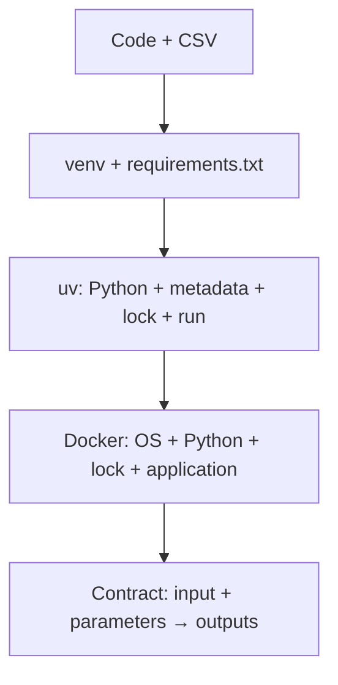

# Tutorial overview

## The scientific computation stays fixed

The supplied project analyses Mel's 50 temperature/ice-cream observations. It:

1. reads the CSV without modifying it;
2. removes missing values and impossible negative ice-cream counts;
3. fits polynomial models of degree 1, 2, and 3 and a cubic-spline model, each with and without an intercept;
4. computes training RMSE and BIC;
5. computes held-out RMSE and MAE-derived accuracy with shuffled five-fold cross-validation;
6. ranks all eight models and predicts at 40 °C;
7. exports a ranking table, JSON summary, and two figures.

Read `SPEC.md`, `src/`, and the tests in stage 1. The environment changes later; the analysis does not.

## Reproducibility ladder



Each level controls more of the execution. None replaces Git, data versioning, tests, documentation, or run provenance.

## Ground rule

An environment migration is successful only when the original tests pass, the input checksum is unchanged, and equivalent inputs and parameters produce equivalent tables.


# Docker Desktop Installation Guide for Students

This guide explains how to install Docker Desktop on Windows, macOS, and Linux for use with Visual Studio Code, Dev Containers, and AI coding assistants.

## Why Docker?

Docker allows you to run software in isolated containers, making it easier to:

* Reproduce development environments
* Install course software without affecting your computer
* Use Visual Studio Code Dev Containers
* Run AI coding agents in controlled environments
* Share projects across different operating systems


## Installation

### Windows

* Install Docker Desktop: https://www.docker.com/products/docker-desktop/

* Follow the installation wizard.

* If prompted, enable WSL 2 (Windows Subsystem for Linux).

* Restart your computer.

* Verify the installation by opening PowerShell and running:

```powershell
docker run hello-world
```

### macOS

* Download Docker Desktop for Mac: https://www.docker.com/products/docker-desktop/

* Install Docker Desktop and launch the application.

* Complete any requested permissions.

* Verify the installation:

```bash
docker run hello-world
```

### Linux (Ubuntu Recommended)

* Install Docker Desktop or Docker Engine following the official Docker documentation:

https://docs.docker.com/

* Verify the installation:

```bash
docker run hello-world
```

### Security Recommendations

Docker can be configured in different ways. For most students, the default installation is sufficient, but it is important to understand the security implications.

#### Recommended: Rootless Docker (Linux)

For Linux users who want the best balance of security and functionality:

* Containers run without root privileges on the host.
* Works well with Visual Studio Code and Dev Containers.
* Reduces risks if a container or extension becomes compromised.

This is the preferred setup when working with research data, private projects, or institutional accounts.

#### Common Setup: Docker Group Membership (Linux)

Many tutorials recommend adding your user account to the Docker group:

```bash
sudo usermod -aG docker $USER
```

This allows Docker commands to run without sudo.

Important: Membership in the Docker group effectively provides root-level access to the system. While this is common and convenient, users should understand the security implications.

#### Most Restrictive Setup

Running Docker commands only with:

```bash
sudo docker ...
```

provides the strongest access control but may be less convenient for development tools and automated workflows.

### Using Docker with Visual Studio Code

Install the following extensions:

* Dev Containers
* Docker
* GitHub Copilot (optional)

These tools allow you to:

* Open projects inside containers
* Use consistent development environments
* Run coding agents and AI assistants in isolated environments

For the best experience, ensure Docker Desktop (or Docker Engine) is running before launching Visual Studio Code.

## Verifying Your Setup

Run the following commands:

```bash
docker --version
docker run hello-world
```

You should see Docker version information and a successful test message.


