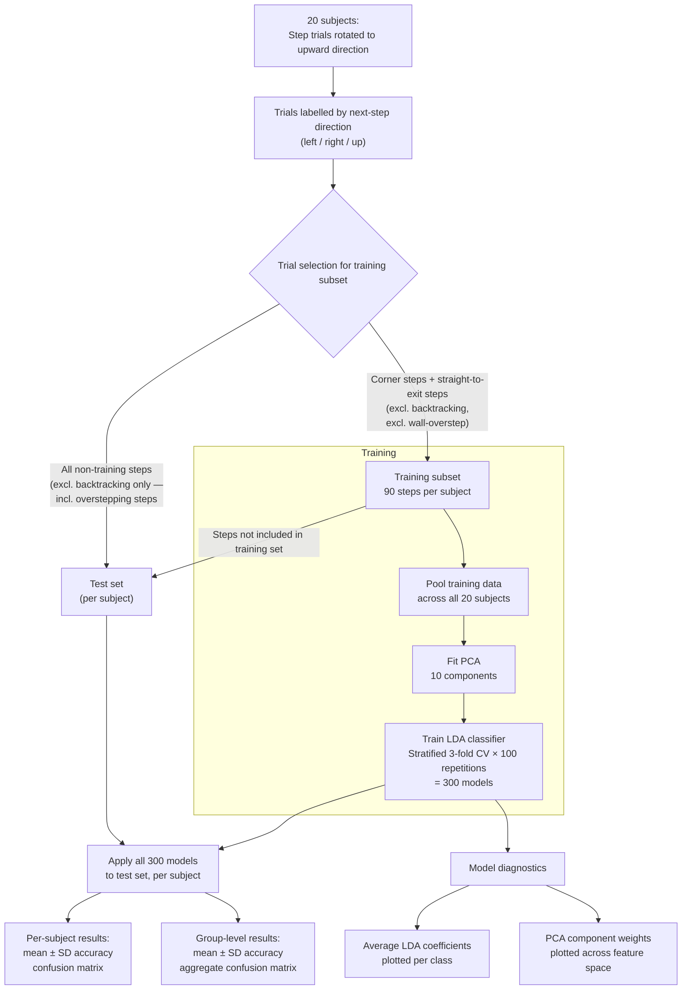


# Reproducible Quantitative Data Science
Coursework day 1 + 2, by Maud Eline Ottenheijm (cqw485)

_**Exercise outline:** Using your PhD research data, protocol, code, etc, write a report explaining from where you start, which measures are already in place to increase reproducibility as per concepts presented during days 1 and 2. What measures can be taken to increase reproducibility and if any, why some cannot be implemented?_

## My PhD project through the lense of reproducibility
My research project is currently in its 3rd year, and during this time I have implemented (/attempted to implement) a number of measures to ensure reproducibility. Other parts of the project may still be improved in this aspect. Below, I specify the measures I took, how they helped improve the project and where there might be room for improvement.

### 1. Data Management Plan
One of the first tasks I undertook as part of my project, was to develop a **Data Management Plan**. This was a good way to think through the logistics of handling, storing and accessing research data, and especially sensitive data. The plan was based on a template, available within DeiC. This was especially helpful, as it listed many considerations I was previously unaware of. The process also helped put the necessary structures in place for storing sensitive vs non-sensitive data (e.g. KU drives).

### 2. Experimental data
Before starting data collection, I outlined and implemented a **BIDS structure** for my dataset. This was done to ensure that my data would be organized into one coherent dataset, and easy to use by me and others. This was done primarily by folder- and filenaming, inclusion of project-level descriptor files (README, participants.tsv, etc.) and the use of interoperable file formats (.csv/.tsv).

My dataset includes the following modalities / data types:
* Behavioral outcomes (events + task variables)
* Motion tracking
* Electromyography
* Electroencephalography
* Non-invasive brain stimulation (TMS)
* Anthropometrics
* Questionnaires

This combination of many modalities benefits greatly from a common structure.

### 3. Preregistration
When starting my project, I intended to write and publish a **preregistration** of my study. This was a valuable experience, and despite not publishing it, the document was a helpful tool to keep me focused on the initial study aims and hypotheses. It additionally forced me to think through the entirety of the study at the beginning.

This process also taught me that preregistrations, and reproducibility more broadly, is difficult. There are many aspects of a study one might not fully understand at the start, and therefore might struggle to specify the details of intended analyses. The process is also time consuming, and may be better suited for some studies compared to others.

### 4. Version control & Documentation
Since before my PhD, I have used and benefitted from **Git and GitHub**. Throughout my PhD project, I have used both tools as a means to back up my code, share code with others and collaborate on projects. Specifically, I set up a GitHub Organization for our research group, which helped with (privately) sharing of and collaborating on code. Additionally, Git has allowed me to move through different versions/approaches of an analysis or task script, without causing chaos in my file manager.

Similarly, I have used **Overleaf** as a writing tool. Here too, the benefits of an online document are its accessibility for collaborators / supervisors.

### 5. Data sharing
From the start of the project, I shared the intention with my supervisor to **publicly share our experimental data** as much as possible, in order to increase reproducibility and potential impact of the research. This became a large focus point when drafting our application with the ethics committee at the Regional Ethics Committee (VEK). We designed our consent forms and participant information with data sharing in mind, and made it a central part of both our ethics application and the study design more broadly.

### 6. MarkDown
During this course, I have explored more of **MarkDown**'s functionality beyond the simple headers and text. It has for example allowed me to add graph structures to README files, which specify workflows. MarkDown has become both a helpful and fun new tool for visualization and documentation. As an example, I have included a flowchart from an analysis here. 

#### Coarticulation analysis

